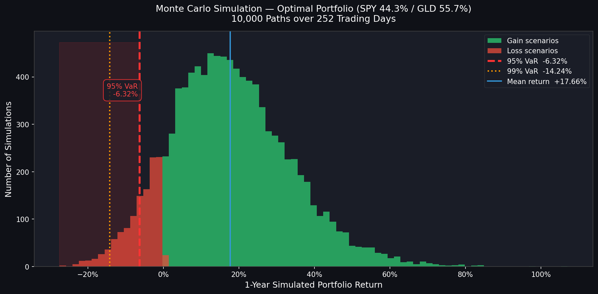

# Macroeconomic Stress-Testing & Portfolio Optimization

A quantitative finance project that builds a complete portfolio analysis pipeline — from raw market data to Sharpe-optimal allocation to Monte Carlo stress-testing — using Python.

---

## Overview

This project answers three core questions every portfolio manager faces:

1. **What have these assets historically returned, and how do they move together?** → Data pipeline & covariance analysis
2. **What is the mathematically optimal way to allocate between them?** → Sharpe Ratio maximization
3. **What is the worst realistic loss I should expect in a bad year?** → Monte Carlo Value at Risk

The asset universe is a classic macro-diversified three-asset portfolio:

| Ticker | Asset Class | Instrument |
|--------|-------------|------------|
| `SPY` | Equities | SPDR S&P 500 ETF |
| `IEAC.AS` | Fixed Income | iShares EUR Corporate Bond ETF |
| `GLD` | Commodities / Store of Value | SPDR Gold Shares ETF |

---

## Results

### Step 1 — Annualised Statistics (last 5 years)

| Asset | Expected Return | Volatility (implied) |
|-------|----------------|----------------------|
| SPY | +14.15% / yr | — |
| IEAC.AS | +0.17% / yr | — |
| GLD | +17.95% / yr | — |

**Annualised Covariance Matrix**

|  | SPY | IEAC.AS | GLD |
|--|-----|---------|-----|
| **SPY** | 0.0283 | 0.0020 | 0.0039 |
| **IEAC.AS** | 0.0020 | 0.0019 | 0.0015 |
| **GLD** | 0.0039 | 0.0015 | 0.0315 |

> **Note:** The unusually positive SPY–IEAC.AS correlation (~0.26) reflects the 2022–2023 rate-hike environment, where both equities and bonds sold off simultaneously — a break from their historically negative relationship.

---

### Step 2 — Optimal Portfolio (Max Sharpe Ratio)

Risk-free rate: **2.0%** (ECB proxy)

| Asset | Optimal Weight |
|-------|---------------|
| SPY | **44.26%** |
| IEAC.AS | **0.00%** |
| GLD | **55.74%** |

| Metric | Optimal Portfolio | Equal-Weight Baseline |
|--------|------------------|-----------------------|
| Expected Return | +16.27% / yr | +10.75% / yr |
| Volatility | 13.13% / yr | 9.21% / yr |
| **Sharpe Ratio** | **1.0863** | **0.9503** |
| Sharpe improvement | **+14.3%** | — |

> **Why zero bonds?** Euro corporate bonds returned only +0.17%/yr over the sample period — the 2022 rate-shock made them a pure drag on risk-adjusted performance. The optimizer correctly excludes them under current macro conditions.

> **Why so much gold?** GLD delivered ~18%/yr with a very low correlation to SPY (~0.13), making it exceptionally efficient in Sharpe terms — a genuine diversifier, not just a hedge.

---

### Step 3 — Monte Carlo Stress Test

10,000 simulated portfolio paths over 252 trading days, using Cholesky-decomposed correlated draws from the historical covariance structure.

| Metric | Value |
|--------|-------|
| Mean simulated return | +17.66% |
| Median simulated return | +16.53% |
| **95% Value at Risk (VaR)** | **-6.32%** |
| **99% Value at Risk (VaR)** | **-14.24%** |

**Interpretation:**
- In **95 out of 100 years**, this portfolio is expected to lose less than **6.32%**
- Only in a severe stress scenario (worst 1% of outcomes) does the loss exceed **14.24%**
- The distribution is right-skewed — large gains (up to ~80%) are possible, while downside is relatively contained



---

## Project Structure

```
├── fetch_portfolio_data.py   # Step 1: Download prices, compute returns & covariance
├── optimize_portfolio.py     # Step 2: Maximize Sharpe Ratio via scipy.optimize
├── monte_carlo_var.py        # Step 3: Monte Carlo simulation & VaR
├── portfolio_returns.csv     # Intermediate: 1,291 rows of daily returns
├── monte_carlo_var.png       # Output: Simulated return distribution chart
└── README.md
```

---

## Installation

**Requirements:** Python 3.9+

```bash
pip install yfinance pandas numpy scipy matplotlib
```

---

## Usage

Run each script in order from the project directory:

```bash
# 1. Download market data and compute statistics
python fetch_portfolio_data.py

# 2. Find the Sharpe-optimal portfolio weights
python optimize_portfolio.py

# 3. Run Monte Carlo stress test and generate chart
python monte_carlo_var.py
```

Each script is self-contained and prints its results to the console. `portfolio_returns.csv` is written by Step 1 and consumed by Steps 2 and 3.

---

## Methodology

| Technique | Detail |
|-----------|--------|
| Returns | Daily percentage change on adjusted close prices |
| Annualisation | Daily statistics × 252 trading days |
| Optimisation | SLSQP via `scipy.optimize.minimize`, 200 random Dirichlet starting points to avoid local minima |
| Constraints | Weights sum to 1; long-only (no short selling) |
| Monte Carlo | Cholesky decomposition of daily covariance for correlated asset draws; geometric compounding over 252 days |
| VaR | Historical simulation from the 10,000 path distribution (non-parametric) |

---

## Limitations & Extensions

- **Look-ahead bias:** Weights are optimised on the full 5-year sample. A walk-forward backtest would give a more honest out-of-sample Sharpe.
- **No transaction costs or taxes** are modelled.
- **Normal returns assumption** in the Monte Carlo — fat tails (kurtosis) in real markets mean tail losses can be worse than VaR suggests. CVaR (Expected Shortfall) would complement this.
- **Potential next steps:** Efficient Frontier plot, rolling Sharpe analysis, regime-switching stress scenarios (e.g., 2008 GFC replay, 2022 rate-shock replay).

---

## Tech Stack

- [yfinance](https://github.com/ranaroussi/yfinance) — market data
- [pandas](https://pandas.pydata.org/) — data wrangling
- [numpy](https://numpy.org/) — numerical computing
- [scipy](https://scipy.org/) — portfolio optimisation
- [matplotlib](https://matplotlib.org/) — visualisation
